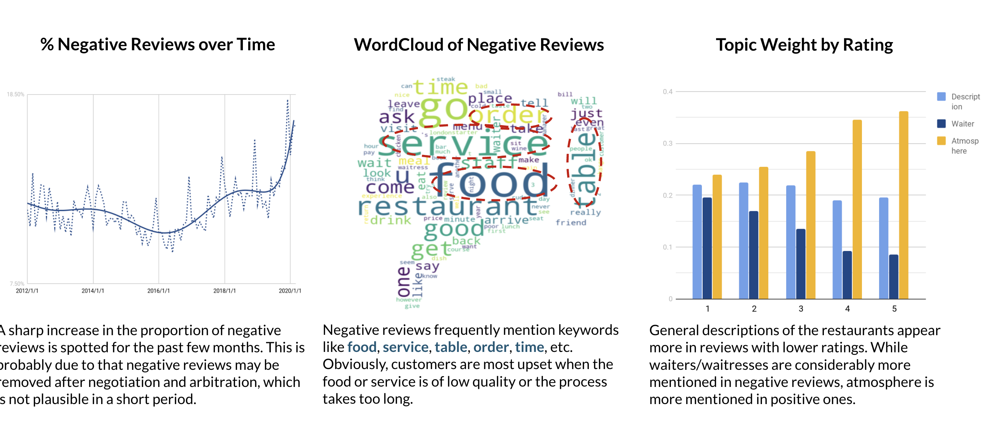

# Delong LI
  

3+ years working experience as a Data Engineer / Data Scientist. Proficient in Python, SQL  
[dbt certification](https://credentials.getdbt.com/6b9bf6a1-64ef-48a1-9ac5-cfb9c6b9df1c#gs.ebjgth); GCP certifying 
## 💡Fun facts about me
- 🌎 Recognise 150+ national flags and their capitals
- 🎸 Play guitar, piano and drumset and record one-man band videos 
- 📚 Language Enthusiast
- 🎾 Tennis Umpire

 
   
## Data Engineering
### [Airflow ELT example DAG](https://github.com/dragonlee97/ELT-Pipeline)
- Stacks: Python, SQL, Airflow, AWS Redshift & S3, GitHub Actions, Jinja
- I summarize and keep updating data engineering good practices in this example dag

### [Data Modelling](https://github.com/dragonlee97/Carpooling)
- Data modelling exercise of both OLTP and OLAP 

### [REST API](https://github.com/dragonlee97/citibike_api)
- FastAPI application designed to query aggregated data from the BigQuery Citibike dataset

 

## Data Science
### [LinkedIn profile classification engine](/pdf/linkedin_project.pdf)
- Stacks: Python, Docker, REST API, Airflow, AWS, Postgres

### [App icon causal analysis](https://github.com/dragonlee97/App-icon)
- Algos & Techniques: OCR, Mask R-CNN, Propensity Score Matching

### [Rebranding for Bokan Restaurant](https://github.com/dragonlee97/Capgemini_DataCamp2020_Group3)
- Algos & Tech: LDA, Word2vec,TF-IDF

 

## BI dashboards
### [My PowerBI Gallery](https://app.powerbi.com/view?r=eyJrIjoiZjhhNmUwYjctZGFlMi00ZGM4LWFlODItNzhhNDBiYTdlYmM1IiwidCI6ImViNWZjMGY0LTIxNjEtNDBkOC04NDkyLTUxNTk0MjQ0OTc5MyIsImMiOjEwfQ%3D%3D)

<!--
**dragonlee97/dragonlee97** is a ✨ _special_ ✨ repository because its `README.md` (this file) appears on your GitHub profile.

Here are some ideas to get you started:

- 🔭 I’m currently working on ...
- 🌱 I’m currently learning ...
- 👯 I’m looking to collaborate on ...
- 🤔 I’m looking for help with ...
- 💬 Ask me about ...
- 📫 How to reach me: ...
- 😄 Pronouns: ...
- ⚡ Fun fact: ...
-->
